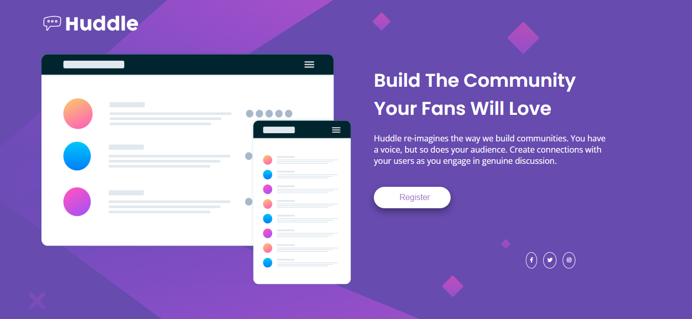
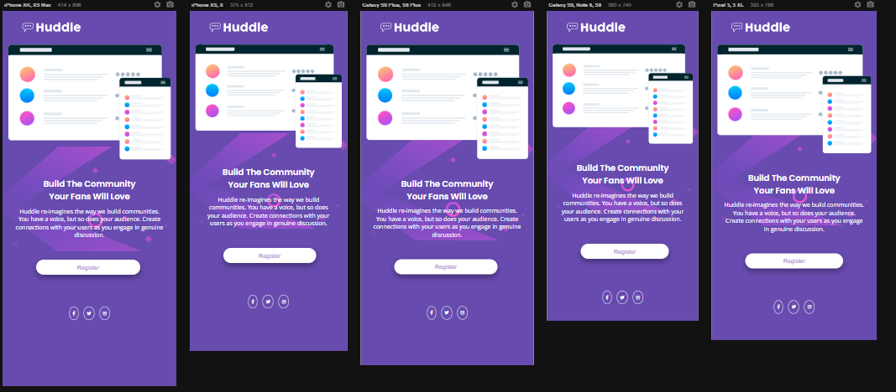

# Huddle - Desafio do Frontend Mentor usado pelo curso Devquest para teste de habilidade dos alunos

Este é um desafio para criar uma landing page com uma seção introdutória única do [Frontend Mentor](https://www.frontendmentor.io/challenges/huddle-landing-page-with-a-single-introductory-section-B_2Wvxgi0). 
Este desafio foi indicado pelo curso [Devquest](https://devemdobro.com/matriculas-abertas/) com a finalidade de nos ajudar a melhorar nossas habilidades na codificação através de projetos realista.

## Índice

- [Visão geral](#visao-geral)
  - [O desafio](#o-desafio)
  - [Captura de tela](#captura-de-tela)
  - [Links](#links)
- [Meu processo](#meu-processo)
  - [Construído com](#construído-com)
  - [O que eu aprendi](#o-que-eu-aprendi)
  - [Desenvolvimento contínuo](#desenvolvimento-contínuo)
  - [Recursos úteis](#recursos-úteis)

## Visão geral

### O desafio

Os usuários devem ser capazes de:

- Vê o layout ideal da página dependendo do tamanho da tela do dispositivo
- Veja os estados de foco para todos os elementos interativos na página

### Captura de tela

### Links

- URL da solução: [Clique aqui](https://your-solution-url.com)

## Meu processo

### Construído com

- Semântica HTML5
- Propriedades personalizadas CSS
- Flexbox
- Fluxo de trabalho voltado para dispositivos móveis

### O que eu aprendi

- Tags semânticas: esta consegue informar ao navegador com mais especificidade o conteúdo a ser interpretado.
- Media queres: um recurso CSS que facilita a configuração dos elementos de um site em tamanhos diversificados de tela.
- Flexbox: o trabalho com o flexbox me ajudou a organizar meus elementos HTML dentros de containers de uma forma completa.

### Desenvolvimento contínuo

Viso me aprofundar mais ainda no flexbox, devido sua capacidade de facilitar o trabalho em organizar os containers. Assim tambem como conhecer melhor sobre grid e javascripts.

### Recursos úteis

Flexbox - Isso me ajudou pelo simples motivo ao qual já falei, a facilidade que nos dar em organizar nossos projetos. Bem diferente quando usamos o float e position.
Media queres - Este é um recurso incrível, pois a facilidade que temos em transformar uma página de desktop para mobile e vice-versa.